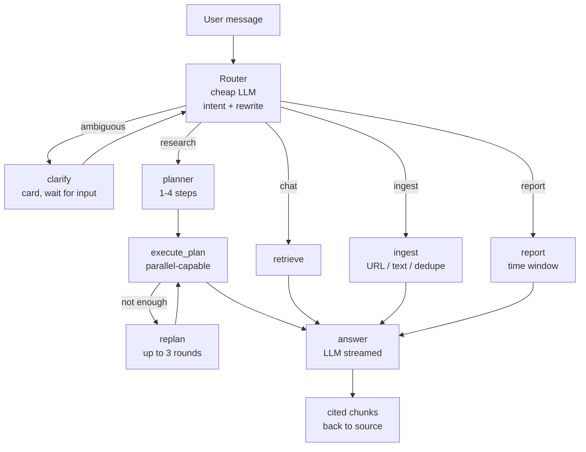

English | [中文](README.zh.md)

<div align="center">

# Saiwu — Personal Knowledge Base Agent

**A local-first personal knowledge assistant that turns scattered files into a searchable, follow-up-able knowledge base — with citations.**

</div>

<div align="center">

[](https://www.python.org)
[](https://vuejs.org)
[](#-license)
[](https://fastapi.tiangolo.com)
[](https://langchain-ai.github.io/langgraph/)
[](https://www.trychroma.com)

[Problems solved](#problems-solved) · [Features](#features) · [Quick Start](#-quick-start) · [Architecture](#-architecture)

</div>

<div align="center">


</div>

***

## Problems Solved

**1. Information is scattered and unrecoverable.** Your files live across PDFs, Word, Excel, PowerPoint, web pages, images, and Feishu docs. Filename search only matches titles — the key facts buried deep inside are found by memory and manual digging.

**2. Generic AI doesn't know your documents.** Ask ChatGPT and it has never seen your project docs, meeting notes, or personal files. Paste everything in and the context window overflows, losing content across follow-up turns.

**3. Answers without sources can't be trusted.** An AI response with no citation can't be verified — you wouldn't base an important decision on it.

**4. Chinese retrieval quality is poor.** Generic vector search handles CJK tokenization and aliases badly; pure keyword search is dragged down by segmentation quality.

**5. Privacy concerns.** Uploading personal material to a third-party cloud service feels wrong — Saiwu keeps all data on your machine (local SQLite + Chroma), and you manage your own API keys.

## Features

In response, Saiwu implements a closed loop of **ingest → retrieve → answer → trust**:

**1. All-format ingestion (11 parse paths)**
PDF (text & scanned OCR), Word, PowerPoint, Excel, CSV, HTML, TXT/MD, images, URLs, Feishu wiki/bitable. Table-aware parsing — merged cells survive the round-trip; scanned PDFs get OCR plus column-cluster table recovery; everything becomes Markdown the LLM can read.

**2. Hybrid retrieval (CJK-friendly)**
Chroma vector (0.7) + SQLite FTS5 BM25 (0.3) dual recall; two-pass CJK queries (phrase match → per-token OR → LIKE fallback); dual thresholds suppress low-quality citations; parent-chunk context expansion — you hit more than a fragment.

**3. Multi-agent Q\&A (LangGraph plan-and-execute)**
A router classifies intent (chat / research / ingest / report) → a planner decomposes complex questions into 1-4 retrieval sub-steps → steps execute (in parallel when enabled) → insufficient material triggers re-planning (up to 3 rounds) → a final synthesized answer. Fully SSE-streamed — plan, every step, and citations are visible in real time.

**4. Human-in-the-loop: clarify + tool approval**
When a question is genuinely ambiguous the router emits a clarify card (e.g. "Which document did you mean?"), waits for one more line, then continues instead of guessing. Under tool-approval mode, destructive tools (file writes, command execution) pop an authorization modal before running — declining aborts that call.

**4.5 Sub-agents and tool governance**
Three built-in sub-agents — explore / plan / general — each with its own system prompt and tool allowlist. Combined with `PreToolUse` / `PostToolUse` hooks, you can run your own script before or after every tool call to validate, log, or veto it (return `{"block": "reason"}`).

**5. Trustworthy answers with citations**
Every conclusion carries `[1] [2]` citations that click back to the source chunk; when there are no references it answers from its own knowledge explicitly — never fabricates sources.

**6. MCP tool calling**
Built-in MCP client (stdio) — the agent discovers and invokes local tools (file read/write, etc.) as needed; sensitive operations go through an approval modal.

**7. Feishu knowledge sync**
Wiki docs and bitable records flow into the same KB; incremental via `obj_edit_time` so changed pages re-ingest in place without breaking existing citations.

**8. Long-term memory + multi-provider LLMs**
Cross-session factual memory — each turn extracts user preferences and context in the background (deduped before persistence) and recalls them on demand; history is summarized once it overflows. Supports OpenAI / Anthropic / DeepSeek / Zhipu / Kimi / SiliconFlow / Ollama / MiniMax, switchable per request.

**9. Project rules (AGENTS.md)**
Automatically collects `AGENTS.md` / `.agents.md` / `CLAUDE.md` / `.claude.md` target-first up to 6 levels and injects the project conventions into the system prompt; also editable in Settings without a restart.

**10. Permissions and security**
Passwords hashed with PBKDF2, sessions signed with an HMAC token (7-day TTL), DOMPurify on the frontend against XSS, zip-slip protection on archive import; destructive MCP tools go through an approval modal by default.

**11. Eval-driven**
Ships a golden set and eval runner (Recall\@K / MRR / smalltalk false-citation rate) — tune weights, rerun, decide with data.

***

## Feature Details

### Inbox — 11 ingest paths

| Format                  | Parser                            | Notes                                                                   |
| ----------------------- | --------------------------------- | ----------------------------------------------------------------------- |
| PDF (text)              | pdfplumber                        | lines-to-text strategy; cross-page header dedup                         |
| PDF (scanned)           | pdfplumber render + Tesseract OCR | column-cluster + row-gap heuristic; Chinese needs `chi_sim.traineddata` |
| DOCX                    | python-docx + raw XML             | `gridSpan` / `vMerge` walked directly (bypasses `_Cell` pooling)        |
| PPTX                    | python-pptx + raw XML             | `gridSpan` / `hMerge` / `rowSpan` / `vMerge`                            |
| XLSX                    | openpyxl                          | `merged_cells.ranges` preserves anchor cells                            |
| CSV                     | native row parsing                | <br />                                                                  |
| HTML                    | BeautifulSoup / trafilatura       | <br />                                                                  |
| TXT / MD                | direct                            | UTF-8 / GBK / Latin-1 fallback                                          |
| Image (PNG / JPG / ...) | Tesseract OCR                     | <br />                                                                  |
| URL                     | trafilatura                       | <br />                                                                  |
| Feishu wiki / bitable   | Feishu Open API + custom parser   | 10 bitable `ui_type`s handled                                           |

Tables come out as Markdown blocks, so downstream chunking preserves structure.

### Retrieval — hybrid + plan-and-execute

- **Vector path** — Chroma cosine, distance-to-score conversion, `mode="query"` first with `mode="db"` fallback for providers that reject query mode (decided by URL up front, so no retry every call).

- **Keyword path** — SQLite FTS5 BM25, CJK-friendly two-pass (phrase match + per-token OR + LIKE fallback).

- **Merging** — dedupe on `(note_id, chunk_index)`, score `0.7 * vec + 0.3 * kw`, dual thresholds (`MIN_FINAL_SCORE` / `MIN_DIM_SCORE`, both 0.18) to suppress low-quality citations.

- **Parent-chunk context expansion** — `merge_neighboring_hits` clusters adjacent chunks within the same note (window 2), then re-reads `[center-2, center+2]` from FTS5 to rebuild the full context; the original hit is kept separately as `matched_text`.

- **Plan-and-execute** — the planner produces a 1-4 step retrieval plan (`HD_PLANNER_MAX_STEPS`), executed step by step; with parallelism on, multiple steps run concurrently (workers = min(steps, 4)) and a single failing step doesn't sink the rest. Insufficient material triggers re-planning up to `HD_RESEARCH_MAX_ITER` rounds (default 3); when a round adds nothing new it stops itself (`replan_stalled`).

- **RAG Eval** — `python scripts/rag_eval/run.py --out report.md` produces a Markdown report with per-category breakdown.

### LLM — multi-provider

- OpenAI, Anthropic (native)

- DeepSeek, Zhipu GLM, Moonshot Kimi, SiliconFlow, Ollama (OpenAI-compatible `base_url`)

- MiniMax (`embo-01` and friends) with native body and automatic mode fallback

- Per-request overrides: `base_url`, `api_key`, `model`, `reasoning_level`, `embedding_model`

### Feishu integration

- OAuth (`app_id + app_secret` -> `tenant_access_token`, cached 2h)

- DFS walk of wiki spaces and bitable tables

- Incremental sync: `obj_edit_time` compared against `Note.source_revision`; changed docs re-ingest in place under the same note id (no broken citations)

- Background loop configurable via `FEISHU_SYNC_INTERVAL_MIN`

- Manual trigger: `POST /api/feishu/sync { "space_id": "...", "force_full": true }`

### Frontend

- Vue 3 + Vite + naive-ui + Pinia

- Saiwu blue theme (`#3b82f6`)

- SSE-driven streaming with stage indicators (session / stage / plan / clarify / citations / message / answer / tool / permission / subagent / ingest / report / error / done)

- Plan card (editable steps, approve / reject) and clarify card (quick-pick or free text)

- Citation cards with click-back to source

- `IngestResultCard` renders structured ingest metadata (title / tags / summary / duplicate warning)

- Settings page for project rules (AGENTS.md), hooks, long-term memory, sub-agents, and permission rules

***

## Architecture



Seven nodes: `router` / `planner` / `execute_plan` / `replan` / `retrieve` / `ingest` / `report`. `execute_plan ⟲ replan` forms the plan-and-execute loop, and each step emits its own SSE event so the UI shows progress instead of hanging.

> Legacy direct-call path is still available: set `HD_USE_GRAPH=false`.

***

## Quick Start

### Prerequisites

- Python 3.10+

- Node.js 18+

- (Optional) Tesseract with `chi_sim.traineddata` for OCR

- (Optional) An OpenAI-compatible API endpoint (OpenAI, Anthropic, DeepSeek, Zhipu, Moonshot, SiliconFlow, Ollama, ...)

### Install

```bash
# One command: install front+back deps, generate .env template, then boot both
python dev.py
```

On first run it automatically:

1. Creates `backend/.venv` and installs `requirements.txt`
2. Installs frontend deps (`pnpm` preferred, falls back to `npm`)
3. Copies `backend/.env.example` -> `backend/.env` if missing
4. Starts the backend (FastAPI, `http://0.0.0.0:5006`) and frontend (Vite, `http://127.0.0.1:5174`)

Then open `http://127.0.0.1:5174`. In **Settings -> Add custom model**, paste your OpenAI-compatible `Base URL`, `API Key`, and detected model names, then visit **Knowledge Base** to upload.

> Useful subcommands:
>
> ```bash
> python dev.py setup       # install deps only
> python dev.py backend     # backend only (logs to terminal)
> python dev.py frontend    # frontend only
> python dev.py --no-setup  # skip dep check, start directly
> ```
>
> On Windows double-click `start.bat`; on macOS / Linux run `./start.sh`.
>
> Manual two-terminal start (optional):
>
> ```powershell
> # Backend
> cd backend
> python -m venv .venv
> .\.venv\Scripts\pip install -r requirements.txt
> copy .env.example .env       # fill LLM_API_KEY + EMBEDDING_API_KEY
> .\.venv\Scripts\python.exe -m uvicorn app.main:app --host 0.0.0.0 --port 5006
>
> # Frontend (new shell)
> cd ..\frontend
> pnpm install                # or npm install
> pnpm dev                    # http://127.0.0.1:5174
> ```

***

## Usage

### Upload + ask

1. **Knowledge Base** -> upload a PDF, Word file, image, text, or URL.
2. Wait for status to flip from `embedding` to `N chunks`.
3. **Chat** page -> flip the knowledge base toggle on, ask anything.

### Complex questions: plan and clarify

- Ask something multi-step like "compare A and B" and the router auto-upgrades it to a research task: a retrieval plan (1-4 steps) is produced first, then executed step by step. The chat shows a plan progress strip (each step goes pending → running → done, with re-search steps drawn dashed) so the whole run is visible.
- The plan toggle sits in the composer toolbar and can be switched off at any time (off = direct retrieval, no sub-queries).
- If the question is too ambiguous, a clarify card appears; pick an option or add a line to continue.

### Configure project rules / hooks / permissions

In **Settings**:

- **Project rules** — edit `AGENTS.md` (or `.agents.md` / `CLAUDE.md` / `.claude.md`) directly; at runtime the agent collects them target-first up to 6 levels, 32KB per file and at most 8 sources.
- **Hooks** — attach scripts to `PreToolUse` / `PostToolUse`; they read JSON from stdin and write JSON to stdout, and returning `{"block": "reason"}` vetoes a tool call (5s default timeout).
- **Sub-agents** — inspect the system prompt and tool allowlist of explore / plan / general.
- **Permission rules** — decide which tools require approval and which pass straight through.
- **Long-term memory** — review and delete auto-extracted facts.

### Enable Feishu sync

```env
FEISHU_ENABLED=true
FEISHU_APP_ID=cli_xxx
FEISHU_APP_SECRET=xxx
FEISHU_SPACE_IDS=7676363835179207668      # empty = all visible spaces
FEISHU_SYNC_INTERVAL_MIN=15                # 0 = manual only
```

Then trigger or wait. The second sync should report `synced=0 skipped=N` for unchanged content.

### Run RAG eval

```powershell
cd backend
.\.venv\Scripts\python.exe ..\scripts\rag_eval\run.py --top-k 5 --out report.md
```

Outputs Recall\@K, MRR, smalltalk false-citation rate, and a per-case breakdown.

### Run table recognition tests

```powershell
cd scripts\table_tests
..\backend\.venv\Scripts\python.exe run_all.py
```

5 of 6 pass without Tesseract; install Tesseract to unlock the scanned PDF case.

***

## Configuration

Environment variables (see `backend/.env.example` for the full template):

| Var                         | Default                 | Purpose                                                                                               |
| --------------------------- | ----------------------- | ----------------------------------------------------------------------------------------------------- |
| `LLM_PROVIDER`              | `openai`                | One of `openai` / `anthropic` / `deepseek` / `zhipu` / `moonshot` / `siliconflow` / `ollama` / custom |
| `LLM_MODEL`                 | `gpt-4o-mini`           | Model id for chat                                                                                     |
| `LLM_API_KEY`               | (empty)                 | Bearer key for the provider                                                                           |
| `LLM_API_BASE`              | (empty)                 | Override base URL (defaults to provider canonical URL)                                                |
| `EMBEDDING_*`               | mirrors `LLM_*`         | Same shape for embedding; for `embo-01` set `EMBEDDING_MODEL=embo-01`                                 |
| `HD_USE_GRAPH`              | `true`                  | LangGraph drives SSE; set `false` to revert to the direct-call path                                   |
| `HD_ROUTER_ENABLED`         | `true`                  | Disable the router to always go straight to `chat`                                                    |
| `HD_ROUTER_MODEL`           | (empty)                 | Optional cheap model for routing (defaults to main)                                                   |
| `HD_PLANNER_ENABLED`        | `true`                  | Disable to skip the planner for complex questions                                                     |
| `HD_PLANNER_MAX_STEPS`      | `4`                     | Max steps in a single plan                                                                            |
| `HD_PARALLEL_PLAN_ENABLED`  | `true`                  | Run multi-step plans concurrently                                                                     |
| `HD_RESEARCH_MAX_ITER`      | `3`                     | Max re-planning rounds                                                                                |
| `HD_RESEARCH_TARGET_CHUNKS` | `8`                     | Stop researching once this many chunks are collected                                                  |
| `HD_MEMORY_EXTRACTION_ENABLED` | `true`               | Extract long-term facts in the background each turn                                                   |
| `HD_MEMORY_MAX_FACTS`       | `8`                     | Max facts recalled per request                                                                        |
| `FEISHU_*`                  | see `.env.example`      | Feishu integration                                                                                    |
| `HD_MAX_UPLOAD_BYTES`       | `52428800`              | 50 MB upload cap                                                                                      |
| `HD_ALLOWED_ORIGINS`        | `http://127.0.0.1:5174` | CORS allowlist (comma-separated)                                                                      |

***

## Documentation

- [docs/FEATURES.md](docs/FEATURES.md) — full feature catalog (including every API endpoint)
- [docs/RAG.md](docs/RAG.md) — RAG three-layer pipeline deep dive
- [docs/SKILLS.md](docs/SKILLS.md) — the Skill system
- [docs/CONTEXT_UPGRADE.md](docs/CONTEXT_UPGRADE.md) — context window and budget upgrade log
- [docs/PLAN.md](docs/PLAN.md) — original roadmap (P0-P9)
- [docs/file-writing-policy.md](docs/file-writing-policy.md) — UTF-8 no-BOM rule

***

## Roadmap

See the acceptance logs in `docs/FEATURES.md` and `docs/CONTEXT_UPGRADE.md` for the current state. Open items:

- Optional auth (`HD_ACCESS_TOKEN` Bearer) for public deployments

- HTTPS + Cloudflare Tunnel when going back online

- NSSM auto-install (`scripts/install-service.ps1`, opt-in)

- Optional PaddleOCR `PP-StructureV2` for higher-quality scanned table recovery

- Move the synchronous `hybrid_search` off the event loop (avoid blocking under load)

***

## License

MIT — see `LICENSE`.

***

## Contributing

PRs welcome. Before submitting, please run the table tests and RAG eval locally and confirm no regressions:

```powershell
cd scripts\table_tests && ..\backend\.venv\Scripts\python.exe run_all.py
cd ..\..\backend && .\..\backend\.venv\Scripts\python.exe ..\scripts\rag_eval\run.py --out report.md
```

