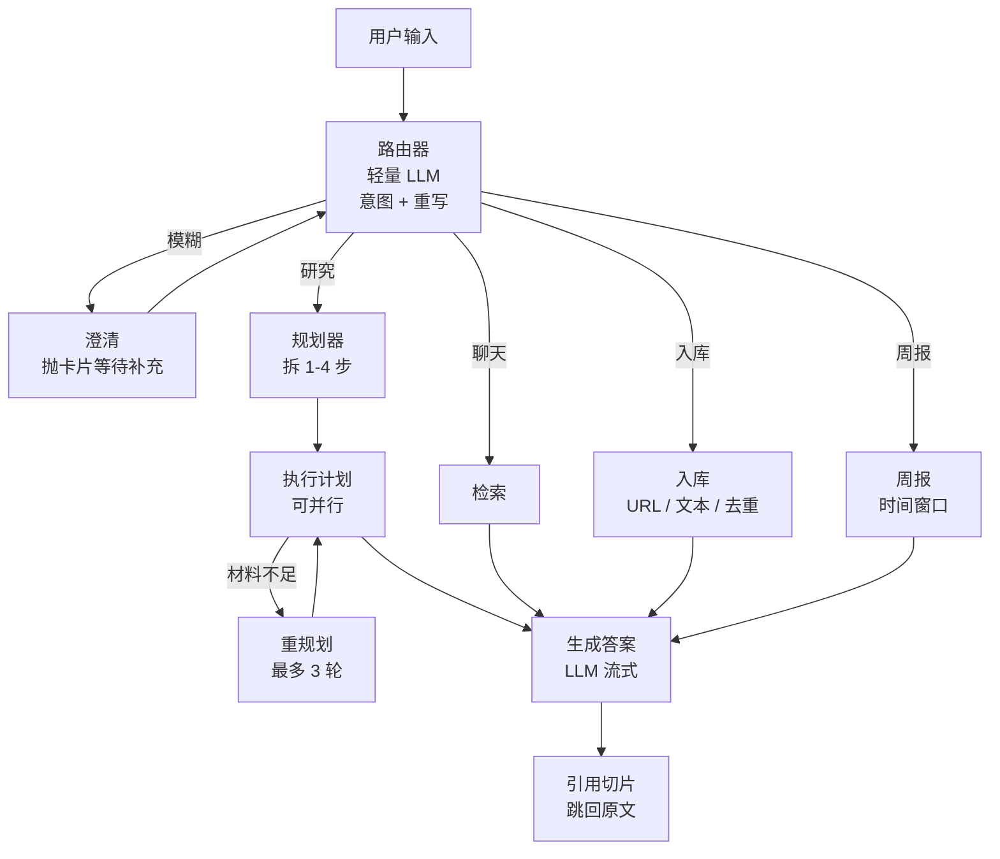

[English](README.md) | 中文

<div align="center">

# Saiwu — 个人知识库智能体

**本地优先的个人知识助手：把散落各处的资料变成可检索、可追问、带引用的知识库。**

</div>

<div align="center">

[](https://www.python.org)
[](https://vuejs.org)
[](#-license)
[](https://fastapi.tiangolo.com)
[](https://langchain-ai.github.io/langgraph/)
[](https://www.trychroma.com)

[解决了什么](#解决了什么问题) · [实现了什么功能](#实现了什么功能) · [快速开始](#快速开始) · [架构](#架构)

</div>

<div align="center">


</div>

***

## 解决了什么问题

**1. 信息散落，找不回来。** 你的资料分散在 PDF、Word、Excel、PPT、网页、图片、飞书文档里——文件名搜索只能匹配标题，藏在内容深处的关键信息只能靠回忆和翻找。

**2. 通用 AI 不认识你的资料。** 直接问大模型，它不知道你的项目文档、会议纪要、个人笔记；整篇贴过去上下文装不下，多轮追问就丢内容。

**3. 没有出处的回答不敢用。** AI 生成的答案若无引用来源，无法核实真伪，重要决策不敢依赖。

**4. 中文检索效果差。** 通用向量检索对中文分词、别名不友好，纯关键词检索又受分词质量拖累，搜"牛魔王"可能连"牛魔"都找不到。

**5. 隐私顾虑。** 个人资料上传到第三方云端服务心里不踏实——Saiwu 全部数据留在本机（SQLite + Chroma 本地存储），模型 API Key 自己管理。

## 实现了什么功能

针对上述问题，Saiwu 实现了一整套「入库 → 检索 → 问答 → 可信」的闭环：

**1. 全格式入库（11 条解析路径）**
PDF（文本型 / 扫描件 OCR）、Word、PPT、Excel、CSV、HTML、TXT / MD、图片、URL、飞书 wiki / 多维表格。表格感知解析——合并单元格完整保留，扫描件走 OCR + 列聚类还原表格，输出 LLM 可直接阅读的 Markdown。

**2. 混合检索（中文友好）**
Chroma 向量（0.7）+ SQLite FTS5 BM25（0.3）双路召回；CJK 两阶段查询（短语匹配 → 单字 OR → LIKE 兜底）；双阈值过滤低质量引用；父块上下文扩展，命中不止是切片。

**3. 多智能体问答（LangGraph plan-and-execute）**
路由器识别意图（聊天 / 研究 / 入库 / 周报）→ 规划器把复杂问题分解为 1-4 个检索子步骤 → 逐步执行（可并行）→ 材料不足自动补查（最多 3 轮）→ 综合回答。全程 SSE 流式，计划、每一步执行、引用都实时可见，不是黑盒。

**4. 人机协同：澄清 + 工具审批**
问题太模糊时，路由器会先抛一张澄清卡片（例："你问的是哪份文档？"），等你补一句再继续，而不是硬猜。工具审批模式下，破坏性工具（写文件、执行命令）调用前会弹窗请求授权，拒绝即中止该次调用。

**4.5 子代理与工具治理**
内置 explore / plan / general 三个子代理（各自独立的提示词与工具白名单），配合 PreToolUse / PostToolUse 钩子，可在工具调用前后插入自己的脚本做校验、记录或直接否决（返回 `{"block": "reason"}`）。

**5. 带引用的可信回答**
每个结论带 `[1] [2]` 引用，点回去就是原文切片；无引用时明确用自有知识回答，不编造来源。

**6. MCP 工具调用**
内置 MCP 客户端（stdio），Agent 按需自主发现并调用本地工具（文件读写等），敏感操作弹窗审批。

**7. 飞书知识库同步**
wiki 文档 + 多维表格拉进同一知识库；按 `obj_edit_time` 增量更新，改过的页面原位重入库，不打断已有引用。

**8. 长期记忆 + 多模型**
跨会话事实记忆——每轮对话后台自动抽取用户偏好与上下文（去重后落库），相关时按需召回；历史过长时自动压缩摘要。支持 OpenAI / Anthropic / DeepSeek / 智谱 / Kimi / SiliconFlow / Ollama / MiniMax，每请求可切换模型。

**9. 项目规则（AGENTS.md）**
自动按 target-first 向上最多 6 层收集 `AGENTS.md` / `.agents.md` / `CLAUDE.md` / `.claude.md`，把项目约定注入系统提示；也可在设置页直接编辑，无需重启。

**10. 权限与安全**
密码走 PBKDF2 哈希，会话用 HMAC 自签 token（TTL 7 天），前端 DOMPurify 防 XSS，压缩包导入有 zip slip 防护；MCP 破坏性工具默认走弹窗审批。

**11. 评测驱动**
内置金标准集与跑分脚本（Recall\@K / MRR / 闲聊误引率），调权重、重跑、用数据说话。

***

## 功能细节

### 入库 — 11 条路径

| 格式                  | 解析器                           | 说明                                           |
| ------------------- | ----------------------------- | -------------------------------------------- |
| PDF（文本型）            | pdfplumber                    | 行对文本策略；跨页标题去重                                |
| PDF（扫描型）            | pdfplumber 渲染 + Tesseract OCR | 列聚类 + 行间距含义；中文需要 `chi_sim.traineddata`       |
| DOCX                | python-docx + 原始 XML          | 直接走 `gridSpan` / `vMerge`，绕过 `_Cell` 池化      |
| PPTX                | python-pptx + 原始 XML          | `gridSpan` / `hMerge` / `rowSpan` / `vMerge` |
| XLSX                | openpyxl                      | `merged_cells.ranges` 保留错柱单元格                |
| CSV                 | 原生行解析                         | <br />                                       |
| HTML                | BeautifulSoup / trafilatura   | <br />                                       |
| TXT / MD            | 直读                            | UTF-8 / GBK / Latin-1 回退                     |
| 图片（PNG / JPG / ...） | Tesseract OCR                 | <br />                                       |
| URL                 | trafilatura                   | <br />                                       |
| 飞书 wiki / 多维表格      | 飞书 Open API + 自定义解析器          | 已覆盖 10 种 `ui_type`                           |

表格最终输出为 Markdown 块，后续切片能保留结构。

### 检索 — 混合 + plan-and-execute

- **向量路径**——Chroma 余弦，距离转分数，优先 `mode="query"`，供应商不支持时降级到 `mode="db"`（按 URL 预判，避免每次重试）。

- **关键词路径**——SQLite FTS5 BM25，友好处理 CJK，两轮查询（短语 + 单词 OR + LIKE 回退）。

- **合并**——按 `(note_id, chunk_index)` 去重，分数 `0.7 * vec + 0.3 * kw`，双阈值（`MIN_FINAL_SCORE` / `MIN_DIM_SCORE`，默认 0.18）过滤低质量引用。

- **父块上下文扩展**——`merge_neighboring_hits` 聚簇同一笔记内相邻切片（窗口 2），再从 FTS5 回捞 `[center-2, center+2]` 拼成完整上下文，原命中片段另存 `matched_text`。

- **plan-and-execute**——规划器产出 1-4 步检索计划（`HD_PLANNER_MAX_STEPS`），逐步执行；开启并行后多步并发跑（worker 数 = min(步数, 4)，单步失败不拖垮整体）。材料不足时 replan 补查，最多 `HD_RESEARCH_MAX_ITER` 轮（默认 3），反复无新增则自动停（`replan_stalled`）。

- **RAG 评测**——`python scripts/rag_eval/run.py --out report.md` 输出含分类拆解的 Markdown 报告。

### LLM — 多提供商

- OpenAI、Anthropic（原生）

- DeepSeek、智谱 GLM、月之暗面 Kimi、SiliconFlow、Ollama（OpenAI 兼容 `base_url`）

- MiniMax（`embo-01` 等），原生 body + 自动 mode 回退

- 每请求可覆盖：`base_url` / `api_key` / `model` / `reasoning_level` / `embedding_model`

### 飞书集成

- OAuth（`app_id + app_secret` -> `tenant_access_token`，缓存 2 小时）

- DFS 遍历 wiki 空间与多维表格

- 增量同步：对比 `obj_edit_time` 与 `Note.source_revision`，变更的页面原 id 重入库（不打断引用）

- 后台循环间隔可由 `FEISHU_SYNC_INTERVAL_MIN` 配置

- 手动触发：`POST /api/feishu/sync { "space_id": "...", "force_full": true }`

### 前端

- Vue 3 + Vite + naive-ui + Pinia

- Saiwu 蓝主题（`#3b82f6`）

- SSE 流式响应 + 阶段指示器（session / stage / plan / clarify / citations / message / answer / tool / permission / subagent / ingest / report / error / done）

- 计划卡片（可编辑步骤、批准/驳回）、澄清卡片（快速选择或自由补充）

- 引用卡片可点回原文片段

- `IngestResultCard` 渲染结构化入库元信息（标题 / 标签 / 摘要 / 重复提示）

- 设置页支持项目规则（AGENTS.md）、钩子、长期记忆、子代理、权限规则的编辑

***

## 架构



节点共 7 个：`router` / `planner` / `execute_plan` / `replan` / `retrieve` / `ingest` / `report`。其中 `execute_plan ⟲ replan` 构成 plan-and-execute 循环，每一步都会推一条 SSE 事件，所以前端能看到进展而不是干等。

> 保留老的直调链路：设 `HD_USE_GRAPH=false` 即可。

***

## 快速开始

### 环境准备

- Python 3.10+

- Node.js 18+

- （可选）Tesseract + `chi_sim.traineddata`，用于 OCR

- （可选）任一个 OpenAI 兼容接口（OpenAI / Anthropic / DeepSeek / 智谱 / 月之暗面 / SiliconFlow / Ollama ...）

### 安装

```bash
# 一条命令：自动装前后端依赖 + 生成 .env 模板 + 拉起前后端
python dev.py
```

首次运行会自动完成：

1. 创建 `backend/.venv` 并安装 `requirements.txt`
2. 安装前端依赖（优先 `pnpm`，回退 `npm`）
3. 若 `backend/.env` 不存在，从 `.env.example` 复制一份
4. 启动后端（FastAPI，`http://0.0.0.0:5006`）与前端（Vite，`http://127.0.0.1:5174`）

然后打开 `http://127.0.0.1:5174`，进入**设置 -> 添加自定义模型**，填入 OpenAI 兼容的 `Base URL` / `API Key` 与检测到的模型名，再进入**知识库**上传文件。

> 常用子命令：
>
> ```bash
> python dev.py setup       # 只装依赖，不启动
> python dev.py backend     # 只启动后端（日志直出终端）
> python dev.py frontend    # 只启动前端
> python dev.py --no-setup  # 跳过依赖检查，直接启动
> ```
>
> Windows 可直接双击 `start.bat`；macOS / Linux 运行 `./start.sh`。
>
> 手动分步启动（可选）：
>
> ```powershell
> # 后端
> cd backend
> python -m venv .venv
> .\.venv\Scripts\pip install -r requirements.txt
> copy .env.example .env       # 填入 LLM_API_KEY + EMBEDDING_API_KEY
> .\.venv\Scripts\python.exe -m uvicorn app.main:app --host 0.0.0.0 --port 5006
>
> # 前端（另开一个终端）
> cd ..\frontend
> pnpm install                # 或 npm install
> pnpm dev                    # http://127.0.0.1:5174
> ```

***

## 使用

### 上传 + 问答

1. **知识库** -> 上传 PDF / Word / 图片 / 文本 / URL。
2. 等状态从 `embedding` 变为 `N chunks`。
3. **聊天**页 -> 打开知识库开关，开始问答。

### 复杂问题：计划与澄清

- 问"对比 A 和 B"这类多步问题，路由器会自动升级为研究任务，先生成检索计划（1-4 步），再逐步执行；聊天区会显示一条计划进度条（每个步骤 pending → running → done，补检索步骤用虚线标出），执行过程全程可见。
- 计划开关在输入框工具栏，可随时关闭（关闭后直接检索，不拆子查询）。
- 问题太模糊时会弹澄清卡片，选一个或补一句话即可继续。

### 配置项目规则 / 钩子 / 权限

进入**设置**页：

- **项目规则** — 直接编辑 `AGENTS.md`（或 `.agents.md` / `CLAUDE.md` / `.claude.md`）；Agent 运行时按 target-first 向上最多 6 层自动收集，单文件 32KB 上限、最多 8 个来源。
- **钩子** — 给 `PreToolUse` / `PostToolUse` 挂脚本，从 stdin 收 JSON、往 stdout 写 JSON，返回 `{"block": "reason"}` 可否决某次工具调用（超时默认 5 秒）。
- **子代理** — 查看 explore / plan / general 三个子代理的提示词与工具白名单。
- **权限规则** — 定义哪些工具走审批、哪些直接放行。
- **长期记忆** — 查看/删除自动沉淀的事实条目。

### 开启飞书同步

```env
FEISHU_ENABLED=true
FEISHU_APP_ID=cli_xxx
FEISHU_APP_SECRET=xxx
FEISHU_SPACE_IDS=7676363835179207668      # 为空 = 所有可见空间
FEISHU_SYNC_INTERVAL_MIN=15                # 0 = 仅手动
```

后续第二次同步应该报 `synced=0 skipped=N`。

### 跑 RAG 评测

```powershell
cd backend
.\.venv\Scripts\python.exe ..\scripts\rag_eval\run.py --top-k 5 --out report.md
```

输出 Recall\@K、MRR、闲聊误引率以及每个样本的分类拆解。

### 跑表格识别测试

```powershell
cd scripts\table_tests
..\backend\.venv\Scripts\python.exe run_all.py
```

没 Tesseract 能跑过 5/6；装 Tesseract 后可以解锁扫描 PDF 场景。

***

## 配置

环境变量（详见 `backend/.env.example`）：

| 变量                          | 默认值                     | 说明                                                                                          |
| --------------------------- | ----------------------- | ------------------------------------------------------------------------------------------- |
| `LLM_PROVIDER`              | `openai`                | `openai` / `anthropic` / `deepseek` / `zhipu` / `moonshot` / `siliconflow` / `ollama` / 自定义 |
| `LLM_MODEL`                 | `gpt-4o-mini`           | 聊天模型                                                                                        |
| `LLM_API_KEY`               | （空）                     | 提供商的 Bearer key                                                                             |
| `LLM_API_BASE`              | （空）                     | 覆盖默认 base URL                                                                               |
| `EMBEDDING_*`               | 同 `LLM_*`               | 向量配置；MiniMax `embo-01` 请设 `EMBEDDING_MODEL=embo-01`                                         |
| `HD_USE_GRAPH`              | `true`                  | LangGraph 驱动 SSE；设 `false` 回退直调                                                             |
| `HD_ROUTER_ENABLED`         | `true`                  | 关闭则总是走 `chat`                                                                               |
| `HD_ROUTER_MODEL`           | （空）                     | 可选轻量路由模型                                                                                    |
| `HD_PLANNER_ENABLED`        | `true`                  | 关闭则复杂问题不走规划器                                                                              |
| `HD_PLANNER_MAX_STEPS`      | `4`                     | 单个计划最多拆几步                                                                                  |
| `HD_PARALLEL_PLAN_ENABLED`  | `true`                  | 多步计划并发执行                                                                                    |
| `HD_RESEARCH_MAX_ITER`      | `3`                     | replan 补查最多几轮                                                                             |
| `HD_RESEARCH_TARGET_CHUNKS` | `8`                     | 攒够多少切片后提前结束                                                                                |
| `HD_MEMORY_EXTRACTION_ENABLED` | `true`               | 每轮后台抽取长期记忆事实                                                                             |
| `HD_MEMORY_MAX_FACTS`       | `8`                     | 单次召回事实条数上限                                                                                 |
| `FEISHU_*`                  | 见 `.env.example`        | 飞书集成                                                                                        |
| `HD_MAX_UPLOAD_BYTES`       | `52428800`              | 50 MB 上传上限                                                                                  |
| `HD_ALLOWED_ORIGINS`        | `http://127.0.0.1:5174` | CORS 白名单，多个用逗号分隔                                                                            |

***

## 文档

- [docs/FEATURES.md](docs/FEATURES.md) — 完整功能清单（含全部 API 端点）
- [docs/RAG.md](docs/RAG.md) — RAG 三层管道深入解析
- [docs/SKILLS.md](docs/SKILLS.md) — 技能（Skill）系统说明
- [docs/CONTEXT_UPGRADE.md](docs/CONTEXT_UPGRADE.md) — 上下文窗口与预算升级记录
- [docs/PLAN.md](docs/PLAN.md) — 原始路线图（P0-P9）
- [docs/file-writing-policy.md](docs/file-writing-policy.md) — UTF-8 no-BOM 约定

***

## 路线图

详见 `docs/FEATURES.md` 与 `docs/CONTEXT_UPGRADE.md` 的验收记录。待完成项：

- 可选鉴权（`HD_ACCESS_TOKEN` Bearer）供公开部署

- HTTPS + Cloudflare Tunnel 重启公网

- NSSM 自动安装（`scripts/install-service.ps1`，需手动开启）

- 可选 PaddleOCR `PP-StructureV2`，提高扫描表格质量

- 同步版 `hybrid_search` 移出事件循环（避免高并发阻塞）

***

## 许可证

MIT 许可证 — 见 `LICENSE`。

***

## 参与贡献

PR 欢迎。提交前请本地跑表格测试和 RAG 评测，确认没有回归：

```powershell
cd scripts\table_tests && ..\backend\.venv\Scripts\python.exe run_all.py
cd ..\..\backend && .\..\backend\.venv\Scripts\python.exe ..\scripts\rag_eval\run.py --out report.md
```

